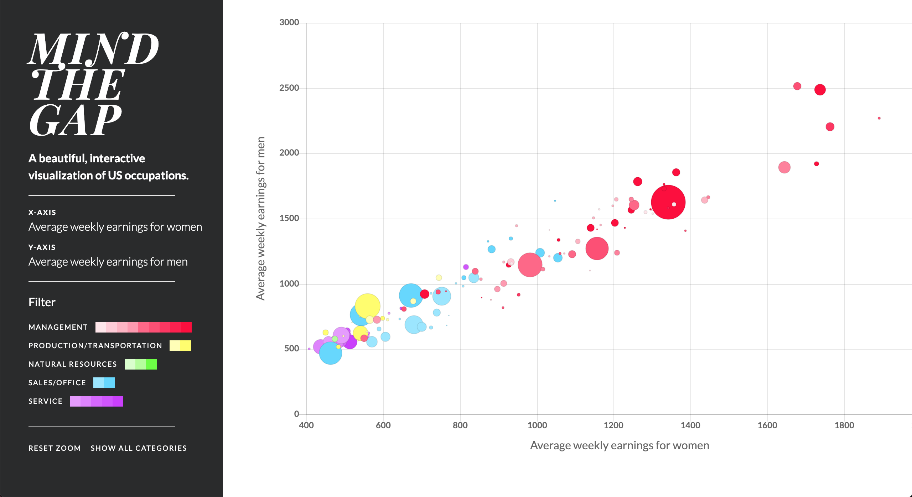

# Mind the Gap

A beautiful, interactive visualization of US occupations.

PixelHacks III Best Website Winner + Top 6 Finisher!

## Inspiration
The gender pay gap is a real, persistent problem in the US, yet many people either don't believe it exists, or worse, turn a blind eye to it. We wanted our project to address this issue and show people that the gap is real, and it won't go away until we take collective action to fix it.

## What it does
Mind the Gap is an interactive bubble chart. The size of each bubble represents the number of employees in each profession, and the color of each bubble corresponds to a subcategory and a larger supercategory.

## How we built it
We crunched numbers from the Bureau of Labor Statistics and formatted it so that it would work in Chart.js, a library for creating charts in Javascript. We then added some pretty sweet features:

* changing the x and y axis to compare different sets of data
* filtering jobs by category, and a button to undo filters
* zooming and panning in the chart, and a button to reset the zoom

## Challenges we ran into
Formatting all the data we copied from the BLS proved to be a lot of work since each set of data is organized slightly differently. It took us a long time to figure out how to get Google Sheets to match up the data from all the sets to each individual job

## Accomplishments that we're proud of
Chart.js is more difficult than we initially thought. We're proud of how nice our website looks, and how smoothly it runs.

## What's next for Mind the Gap
First, we would like to build a program that automatically scrapes the information from the bureau whenever the website is updated. This time, we created and formatted the entire dataset manually, which cost us a lot of time. Having the database update itself will allow us to no longer need to go through all 300 plus jobs every time something gets updated, which would save us a significant amount of effort.

Second, we would like to expand our database. As mentioned before, it currently only contains the newest statistics for the entire nation, and does not have data from previous years. We would also like to add information on jobs by county and state.

Finally, we’d love to spread the word about Mind the Gap. A great place to start would be posting on ProductHunt, where it will reach many in the tech industry.

(c) 2019 Olivia Chang and Rainy Yan. All rights reserved.